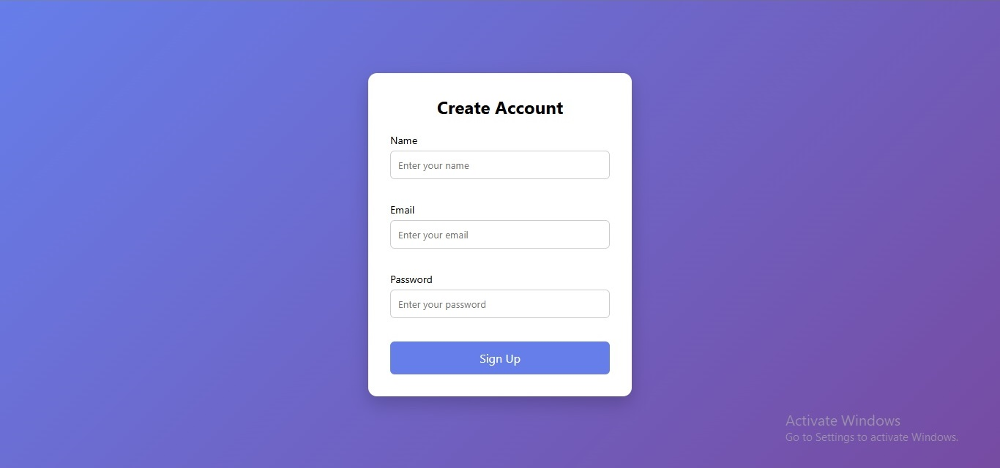

# Project Name

A brief description of what this project does and why it's useful.

## ✨ Features
*   User-friendly Signup interface
*   Mobile responsive design
*   Integrated with [Link to Service]

## 📸 Preview
Here is a look at the signup process:



## 🔗 Important Links
*   **Live Demo:** [Click here to view the project](https://your-link-here.com)
*   **Documentation:** [Read the docs](https://your-docs-link.com)
*   **Contact:** [Get in touch](mailto:your-email@example.com)

## 🚀 How to Run
1. Clone the repo:
   ```bash
   git clone https://github.com
   ```
2. Open `index.html` in your browser.
